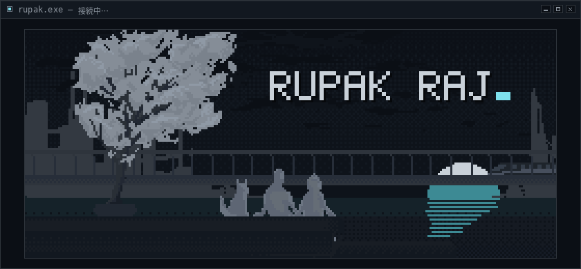
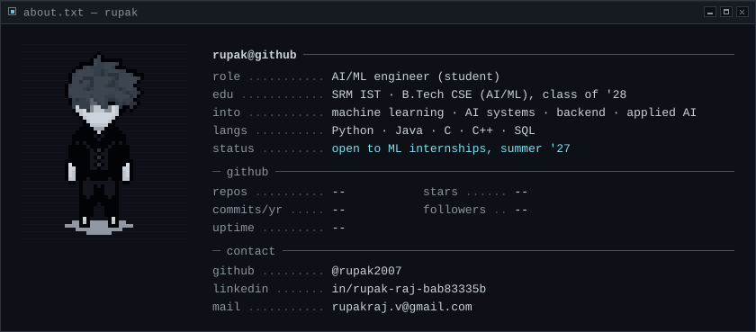
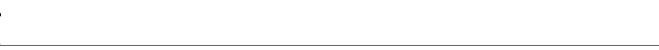
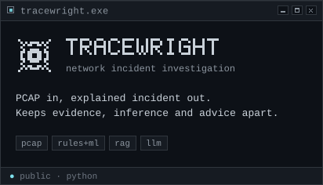
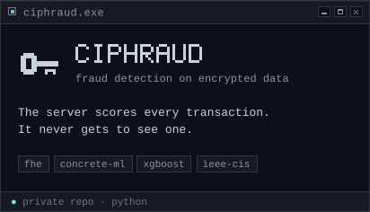
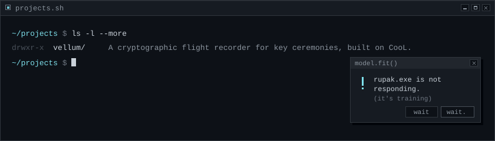
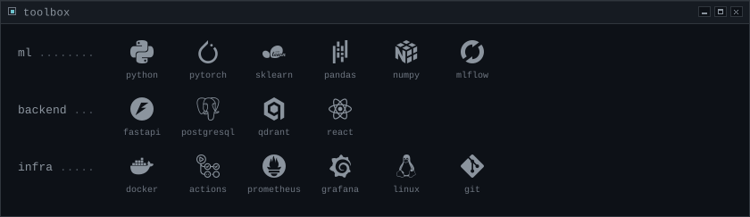

<!-- generated by scripts/build.py from profile.config.json — edit those, not this file -->

  

  

<a href="https://github.com/rupak2007">github</a> · <a href="https://www.linkedin.com/in/rupak-raj-bab83335b/">linkedin</a> · <a href="mailto:rupakraj.v@gmail.com">mail</a>

  
  

  

  

  <picture>
    <source media="(prefers-color-scheme: dark)" srcset="https://raw.githubusercontent.com/rupak2007/rupak2007/output/snake-dark.svg" />
    <source media="(prefers-color-scheme: light)" srcset="https://raw.githubusercontent.com/rupak2007/rupak2007/output/snake-light.svg" />
    
  </picture>

pixel art by getjared, kotnaszynce and Kenney, all CC0 · logos via Simple Icons · <a href="CREDITS.md">credits</a>

